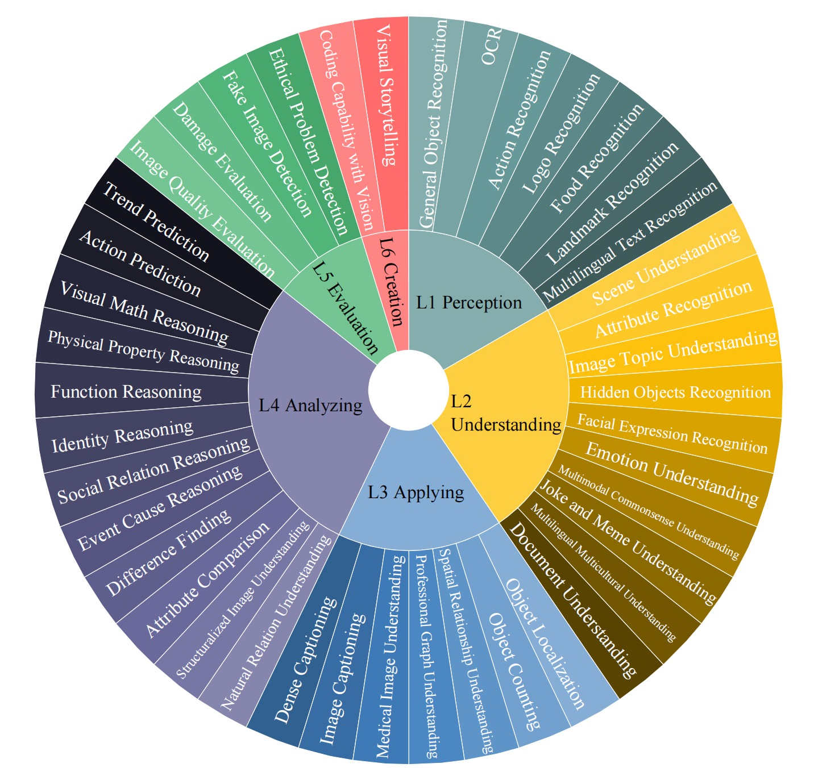

# MLLM-Bench
MLLM-Bench: Evaluating Multimodal LLMs with Per-sample Criteria
<center>

   
</center>

<p align="center">
   📃 <a href="https://arxiv.org/abs/2311.13951" target="_blank">Paper</a> • 🌐 <a href="https://mllm-bench.llmzoo.com/" target="_blank">Website</a> • 🤗 <a href="huggingface.com" target="_blank">HuggingFace</a>  

<p align="center">



## 🌈 Update
* **[2024.4.27]** V3 data, benchmark reuslts, leaderboard and arxiv paper are updated. We keep all the per-sample criteria at evaluation private. However, we provide  <a href="https://mllm-bench.llmzoo.com/static/submit.html" target="_blank">a submission entry</a>  for FREE evaluations. Check it out!

* **[2024.1.7]** V2 data, reuslts and leaderboard are updated.

* **[2023.11.18]** 🎉🎉🎉 This repo is made public!🎉🎉🎉

## Leaderboard
We present the results of voting using LLaVA-v1.5-13B as anchor. The numbers denote *win/tie/lose* of a benchmarked model over LLaVA-v1.5-13B. See more results of different evaluation protocols and anchors in our  [paper](https://arxiv.org/abs/2311.13951). The information of benchmarked models is [here](./Model_cards.md).


| **Rank** | **Models**       | **Perception**  | **Understanding** | **Applying** | **Analyzing** | **Evaluation** | **Creation** | **Win Rates over LLaVA-v1.5-13B** |
|------|-----------------------|-------------|---------------|----------|-----------|------------|----------|-----------------------|
| 🏅️  | GPT-4o             | 64/5/1     | 98/11/1        | 50/8/2  | 86/9/5   | 40/0/0     | 38/1/1   | 0.90                  |
| 🥈  | Claude-3              | 56/13/1     | 98/9/3        | 45/11/4  | 83/14/3   | 33/5/2     | 33/6/1   | 0.83                  |
| 🥉  | GPT-4V                | 56/10/4     | 101/6/3       | 29/12/19 | 73/22/5   | 33/2/5     | 2/0/38   | 0.70                  |
| 4  | LLaVA-v1.6-34B        | 46/17/7     | 78/22/10      | 36/15/9  | 61/28/11  | 33/3/4     | 24/10/6  | 0.66                  |
| 5    | LLaVA-v1.6-Vicuna-13B | 40/21/9     | 65/33/12      | 35/19/6  | 51/26/23  | 33/5/2     | 27/9/4   | 0.60                  |
| 6   | LLaVA-v1.6-Vicuna-7B  | 31/25/14    | 56/37/17      | 26/23/11 | 40/31/29  | 22/10/8    | 19/10/11 | 0.46                  |
| 7    | ALLaVA-3B-Longer      | 22/21/27    | 57/30/23      | 23/17/20 | 44/30/26  | 16/10/14   | 17/12/11 | 0.43                  |
| 8    | Gemini-1.0-Pro        | 45/10/15    | 36/35/39      | 24/19/17 | 33/28/39  | 9/8/23     | 16/8/16  | 0.39                  |
| 9    | Qwen-VL-Chat          | 34/22/14    | 38/36/36      | 26/18/16 | 35/29/36  | 15/6/19    | 9/12/19  | 0.37                  |
| 10    | LVIS                  | 22/28/20    | 32/39/39      | 11/27/22 | 33/36/31  | 14/9/17    | 9/16/15  | 0.29                  |
| 11   | mPLUG-Owl2            | 16/24/30    | 30/34/46      | 17/17/26 | 23/38/39  | 15/8/17    | 11/14/15 | 0.27                  |
| 12   | LLaVA-v1.5-7B         | 19/22/29    | 27/47/36      | 13/29/18 | 21/43/36  | 9/14/17    | 8/13/19  | 0.23                  |
| 13   | MiniGPT-v2            | 12/25/33    | 24/32/54      | 11/25/24 | 17/38/45  | 9/9/22     | 6/6/28   | 0.19                  |
| 14   | InstructBLIP          | 15/16/39    | 13/36/61      | 6/23/31  | 13/29/58  | 10/7/23    | 4/9/27   | 0.15                  |
| 15   | Cheetor               | 12/20/38    | 7/27/76       | 10/22/28 | 16/23/61  | 4/4/32     | 3/4/33   | 0.12                  |
| 16   | SEED-LLaMA            | 16/15/39    | 5/25/80       | 10/21/29 | 7/25/68   | 3/7/30     | 3/3/34   | 0.10                  |
| 17   | kosmos2               | 6/22/42     | 6/18/86       | 6/15/39  | 10/20/70  | 1/4/35     | 2/3/35   | 0.07                  |
| 18   | Yi-VL-6B              | 4/17/49     | 8/22/80       | 5/27/28  | 5/29/66   | 3/9/28     | 3/9/28   | 0.07                  |
| 19   | Fuyu-8B               | 7/19/44     | 7/27/76       | 6/14/40  | 4/22/74   | 3/7/30     | 0/6/34   | 0.06                  |
| 20   | LWM                   | 2/18/50     | 5/15/90       | 4/21/35  | 2/18/80   | 3/2/35     | 2/6/32   | 0.04                  |
| 21   | OpenFlamingo          | 8/13/49     | 2/8/100       | 3/14/43  | 2/21/77   | 1/2/37     | 1/5/34   | 0.04                  |
| 22   | BLIP2                 | 3/13/54     | 2/15/93       | 6/8/46   | 0/22/78   | 0/1/39     | 0/2/38   | 0.03                  |


## Usage
### Environment Setup
<details><summary>Click to expand</summary>
   
Install required packages:
```bash
pip install -r requirements.txt
```
Update `transformers` (we used `4.36.0.dev0`):
```bash
pip install git+https://github.com/huggingface/transformers
```

</details>


### Answer Generation
<details><summary>Click to expand</summary>

- Configurate `accelerate` settings. We use `bf16` inference by default. If this is not supported by your device, set `downcast_bf16` to `false` and `mixed_precision` to `fp16`.

- Add model information in [configs/model_configs.yaml](./configs/model_configs.yaml)

- Create a model worker in [workers/model_workers.py](./workers/model_workers.py). The worker should inherit `BaseWorker`.
Rewrite `init_components()` and `forward()` method. Explanations of parameters and outputs of the two methods are in [workers/baseworker.py](./workers/baseworker.py).

- Run `bash generate.sh`.


</details>

### Self-Evaluation
<details><summary>Click to expand</summary>

- Prepare the data in the format as shown in [data/anchor.json](./data/anchor.json), note that the key "unique_idx", "gen_model_id", and "answer" are required. Move your data under [data](./data/) folder.

- Modify the parameters in [evaluate.sh](./evaluate.sh), especially "model_name" and "model2_path".

- Put your OpenAI API key in [evaluate.py](./scripts/evaluate.py), please make sure you have access to model "gpt-4-vision-preview".

- Run `bash evaluate.sh`.

- Run `cd scripts & bash evaluate4elo.sh` for elo rating.
  
- NOTE: The per sample criteria are not provided for self-evaluate and this self-evaluation process is just used for your reference. If you wish your results to be displayed on the leaderboard, please refer to [Submission for Leaderboard](#submission-for-leaderboard).

</details>

### Submission for Leaderboard
Refer to instructions <a href="https://mllm-bench.llmzoo.com/static/submit.html" target="_blank">here</a>.


## Citation
```angular2
@misc{ge2024mllmbench,
      title={MLLM-Bench: Evaluating Multimodal LLMs with Per-sample Criteria}, 
      author={Wentao Ge and Shunian Chen and Guiming Hardy Chen and Zhihong Chen and Junying Chen and Shuo Yan and Chenghao Zhu and Ziyue Lin and Wenya Xie and Xinyi Zhang and Yichen Chai and Xiaoyu Liu and Nuo Chen and Dingjie Song and Xidong Wang and Anningzhe Gao and Zhiyi Zhang and Jianquan Li and Xiang Wan and Benyou Wang},
      year={2024},
      eprint={2311.13951},
      archivePrefix={arXiv},
      primaryClass={cs.CL}
}
```


## Star History

<a href="https://star-history.com/#FreedomIntelligence/MLLM-Bench&Date">
  <picture>
    <source media="(prefers-color-scheme: dark)" srcset="https://api.star-history.com/svg?repos=FreedomIntelligence/MLLM-Bench&type=Date&theme=dark" />
    <source media="(prefers-color-scheme: light)" srcset="https://api.star-history.com/svg?repos=FreedomIntelligence/MLLM-Bench&type=Date" />
    
  </picture>
</a>
